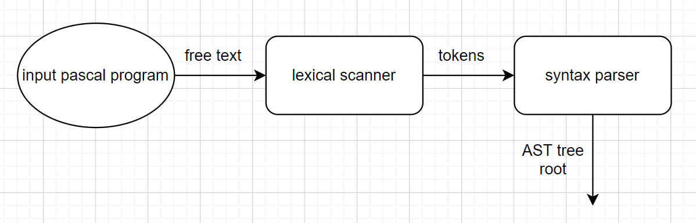

# 编译原理Project-实验报告

### **组员信息：**

​	**张振宇    3190104896**

​	**颜天明    3190105027**

​	**高婧        3180104228**


### 一、工程概述

​	我们实现的语言是类似Pascal语言格式的MiniPascal语言，可以说是Pascal语言的子集，在一些地方做出了改变。

​	我们支持的功能有：

- 基本数据类型：integer，char，bool，real
- 数组：支持所有基本数据类型
- 全局变量与局部变量的声明与使用
- 函数的声明与调用
- 基本语句：if-else, while, repeat, for, break等
- 注释
- 赋值语句和运算语句隐含类型转换
- 编译错误提示

​	我们开发的环境为：Ubuntu -18.04，flex，bison，LLVM-6.0，Clang-6.0

​	开发全程采用Github进行版本控制及协作，目前commit次数达50余次

​	

​	采用的技术路线为：利用lex进行词法分析生成Token序列，利用yacc进行语法分析并构建语法树。

​	即下图中的上面一条路线。


​	生成语法树之后，利用LLVM框架，遍历语法树生成IR代码。

​	生成IR代码之后，直接利用Clang编译器将IR代码编译为机器码，生成可执行文件


### 二、词法分析
####2.1. 工具介绍
在这次的实验当中，我们使用flex来完成词法分析过程。flex（快速词法分析产生器，fast lexical analyzer generator）是一种词法分析程序。它是lex的开放源代码版本，以BSD许可证发布。通常与GNU bison一同运作，但是它本身不不是GNU计划的一部分。
词法分析是将字符序列列转换为标记(token)序列列的过程。在词法分析阶段，编译器器读入源程序字符串流，将字符流转换为标记序列，同时将所需要的信息存储，然后将结果交给语法分析器。这是编译程序的第一个阶段且是必要阶段；词法分析的核心任务是扫描、识别单词且对识别出的单词给出定性、定长的处理。处理完成后，词法分析程序会生成将之前的程序文本转变为一系列token，传给之后的语法分析程序。示意图如下：

标准lex文件由三部分组成，分别是定义区、规则区和⽤用户子过程区。在定义区，⽤用户可以编写C语⾔言中的声明语句，导入需要的头文件或声明变量。在规则区，用户需要编写以正则表达式和对应的动作的形式的代码。在用户子过程区，用户可以定义函数。
####2.2 实现过程
#####2.2.1 立即数
```c++
digit [0-9]
letter [a-zA-Z]
string \"[^"]*\"
char \'.\'
id ({letter}|_)+({letter}|_|{digit})*
[0-9]{digit}* {
    yylval.type_int = atoi(yytext);   
    printf("%s\n",yytext);return INT;
}

-?(0|int)[.]{digit}+ {
    yylval.type_float = atof(yytext);
    printf("%s\n",yytext);return FLOAT;
}

{string} {
    char s[30] = {0};
    for(int i=0;i<strlen(yytext)-2;i++){
        s[i] = yytext[i+1];
    }
    yylval.type_string = s;
    printf("%s\n",yytext);return STRING;
}
"'\\n'" {
    yylval.type_char = 10;
    return CHAR;
}

"'\\0" {
    yylval.type_char = 0;
    return CHAR;
}
{char} {
    yylval.type_char = yytext[1];
    printf("%s\n",yytext);return CHAR;
}

{id} {
    yylval.id = strdup(yytext);
    printf("%s\n",yytext);return ID;
}
```
对于integer类型，我们检测一连串的数字；对于char类型，我们检测''包裹的任何一个单个字符和\开始的转义字符，对于string类型，我们检测""包裹的一连串的字符，对于identify类型，我们检测字母和下划线开头的一连串字符。
#####2.2.2 保留字
```c++
"integer" { printf("%s\n",yytext);return TYPE_INT; printf("integer");}
"real" { printf("%s\n",yytext);return TYPE_FLOAT_8;}
"char" { printf("%s\n",yytext);return TYPE_CHAR;}
"string" { printf("%s\n",yytext);return TYPE_STRING;}
"array" { printf("%s\n",yytext);return ARRAY;}
"begin" { printf("%s\n",yytext);return BEGN;}
"break" { printf("%s\n",yytext);return BREAK;}
"case" { printf("%s\n",yytext);return CASE;}
"const" { printf("%s\n",yytext);return CONST;}
"to" { printf("%s\n",yytext);return TO;}
"do" { printf("%s\n",yytext);return DO;}
"else" { printf("%s\n",yytext);return ELSE;}
"end" { printf("%s\n",yytext);return END;}
"for" { printf("%s\n",yytext);return FOR;}
"function" { printf("%s\n",yytext);return FUNC;}
"if" { printf("%s\n",yytext);return IF;}
"of" { printf("%s\n",yytext);return OF;}
"procedure" { printf("%s\n",yytext);return PROC;}
"program" { printf("%s\n",yytext);return PROG;}
"repeat" { printf("%s\n",yytext);return REPEAT;}
"then" { printf("%s\n",yytext);return THEN;}
"until" { printf("%s\n",yytext);return UNTIL;}
"var" { printf("%s\n",yytext);return VAR;}
"while" { printf("%s\n",yytext);return WHILE;}
```
我们实现了部分pascal关键字的检测
#####2.2.3 运算符
```c++
"not" { printf("%s\n",yytext);return NOT;}
"+" { printf("%s\n",yytext);return ADD;}
[-] { printf("%s\n",yytext);return SUB;}
"*" { printf("%s\n",yytext);return MUL;}
"/" { printf("%s\n",yytext);return DIV;}
"mod" { printf("%s\n",yytext);return MOD;}
"div" { printf("%s\n",yytext);return IDIV;}
"=" { printf("%s\n",yytext);return EQ;}
">" { printf("%s\n",yytext);return GRE;}
"<" { printf("%s\n",yytext);return LES;}
">=" { printf("%s\n",yytext);return GREQ;}
"<=" { printf("%s\n",yytext);return LESQ;}
"<>" { printf("%s\n",yytext);return NE;}
"or" { printf("%s\n",yytext);return OR;}
"and" { printf("%s\n",yytext);return AND;}
":=" { printf("%s\n",yytext);return ASSIGN;}
".." { printf("%s\n",yytext);return ARANGE;}
"[" { printf("%s\n",yytext);return LBR;}
"]" { printf("%s\n",yytext);return RBR;}
"(" { printf("%s\n",yytext);return LPR;}
")" { printf("%s\n",yytext);return RPR;}
"." { printf("%s\n",yytext);return DOT;}
"," { printf("%s\n",yytext);return COM;}
":" { printf("%s\n",yytext);return COL;}
";" { printf("%s\n",yytext);return SEMI;}
"^" { printf("%s\n",yytext);return CARET;}
"\n" {}
```
我们实现了pascal中运算符的检测。

### 三、语法分析
####3.1 工具介绍
yacc(Yet Another Compiler Compiler)，是一个经典的生成语法分析器的工具。yacc生成的编译器主要是用C语言写成的语法解析器（Parser），需要与词法解析器Lex一起使用，再把两部份产生出来的C程序一并编译。
yacc的输入是巴科斯范式（BNF）表达的语法规则以及语法规约的处理代码，Yacc输出的是基于表驱动的编译器，包含输入的语法规约的处理代码部分。yacc是开发编译器的一个有用的工具,采用LALR(1)语法分析方法。
与Lex相似，Yacc的输⼊入文件由以%%分割的三部分组成，分别是声明区、规则区和程序区。三部分的功能与Lex相似，不同的是规则区的正则表达式替换为CFG，在声明区要提前声明好使用到的终结符以及非终结符的类型。
在实验中，我们使用bison来进行yacc文件的编译。

####3.2 实现过程
#####3.2.1 引入ast结点
```c++
%union{
    int type_int;
    float type_float;
    char type_char;
    char* type_string;
    char* id;
    ExprList* expr_list;
    Expr* expr_node;
    IDExpr* id_expr;
    Program* program_node;
    DeclPart* decl_part;
    FuncDeclList* func_list;
    OneFuncDecl* func_node;
    FuncHead* func_head;
    FuncBody* func_body;
    ExecPart* exec_part;
    Stmt* stmt_node;
    StmtList* stmt_list;
    AssignStmt* assign_node;
    ForStmt* for_node;
    FuncCallStmt* call_node;
    RepeatStmt* repeat_node;
    WhileStmt* while_node;
    IfStmt* if_node;
    ElseStmt* else_node;
    BreakStmt* break_node;
    VarDeclList* var_list;
    VarDecl* var_node;
    MyType* type_node;
    SimpleType* simple_type;
    IDList* id_list;
    ArrayType* array_type;
    ParaList* para_node;
    ProgHead* prog_head;
    BinExpr* bin_expr;
    UnaryExpr* un_expr;
    FunCallExpr* funcall_expr;
    ArrayExpr* array_expr;
}
```
在这里我们引入了ast文件中定义的各个结点结构，用作后面的非终结符类型定义。
#####3.2.2 token定义
```c++
// 数据类型定义
%token TYPE_INT TYPE_INT_8 TYPE_INT_16 TYPE TYPE_INT_32 TYPE_INT_64 TYPE_BYTE TYPE_WORD TYPE_FLOAT_8 TYPE_FLOAT_16 TYPE_FLOAT_32 TYPE_BOOL TYPE_CHAR TYPE_STRING
// 符号
%token NOT ADD SUB MUL DIV MOD IDIV EQ GRE LES GREQ LESQ NE OR AND ASSIGN ARANGE LBR RBR LPR RPR DOT COM COL SEMI CARET
// 其他保留字
%token ARRAY BEGN BREAK CASE CONST TO DO ELSE END FOR FUNC IF OF PROC PROG REPEAT THEN UNTIL VAR WHILE
```
#####3.2.3 非终结符定义
```c++
// 数据常量
%token<type_int> INT 
%token<type_float> FLOAT 
%token<type_char> CHAR
%token<type_string> STRING ID
// 结点
%type<expr_list> expr_list;
%type<expr_node> expr_node;
%type<id_expr> id_expr;
%type<program_node> program_node;
%type<decl_part> decl_part;
%type<func_list> func_list;
%type<func_node> func_node;
%type<func_head> func_head;
%type<func_body> func_body;
%type<exec_part> exec_part;
%type<stmt_node> stmt_node;
%type<stmt_list> stmt_list;
%type<assign_node> assign_node;
%type<for_node> for_node;
%type<call_node> call_node;
%type<repeat_node> repeat_node;
%type<while_node> while_node;
%type<if_node> if_node;
%type<else_node> else_node;
%type<break_node> break_node;
%type<var_list> var_list;
%type<var_node> var_node;
%type<simple_type> simple_type;
%type<id_list> id_list;
%type<para_node> para_node;
%type<prog_head> prog_head;
%type<expr_node> first_bin_expr;
%type<expr_node> second_bin_expr;
%type<expr_node> third_bin_expr;
%type<array_expr> array_expr;
```
我们使用之前引入的ast结点来定义这些非终结符。
#####3.2.4 分析过程
```c++
program:
    program program_node
    | 
    ;

program_node:
    prog_head decl_part exec_part DOT { 
        ast_root = new Program($1, $2, $3); 
    }
;
```
我们将程序分为头部，定义部分，执行部分三个部分，每次新分析一个语句，我们都会建立一个对应的新结点，并将其需要的子节点赋值进去。
```c++
decl_part:
    VAR var_list func_list { 
        $$ = new DeclPart($2, $3); 
    }
    |
    { $$ = new DeclPart(); }
;
exec_part:
    BEGN stmt_list END { 
        $$ = new ExecPart($2);
    }
;
```
定义部分分为变量定义和函数定义，执行分为为一系列单独的可执行语句构成。
```c++
var_list:
    var_list var_node SEMI
{ $$ = $1;
  $$->pushVarDecl($2); }
    | 
{ $$ = new VarDeclList(); }
;

var_node:
    id_list COL simple_type{
        $$ = new VarDecl($3, $1); 
    }
    | id_list COL ARRAY LBR INT ARANGE INT RBR OF simple_type{
        ArrayType* ary = new ArrayType($5, $7, $10->getSimpleTypeName()); 
        $$ = new VarDecl(ary, $1);
    }
;
```
变量定义部分由一系列变量定义语句构成，一个单独的变量定义语句包括一组identidy开头，符号:紧随其后，加上变量类型（）可以是数组），后面可以加上初始化的部分。
```c++
simple_type:
    TYPE_INT
{ $$ = new SimpleType("integer"); }
    | TYPE_FLOAT_8
{ $$ = new SimpleType("real"); }
    | TYPE_FLOAT_32
{ $$ = new SimpleType("real"); }
    | TYPE_CHAR
{ $$ = new SimpleType("char"); }
    | TYPE_STRING
{ $$ = new SimpleType("string"); }
;
```
我们实现了以上五个数据类型的检测
```c++
func_list:
    func_list func_node
{ $$ = $1;
  $$->pushOneFuncDecl($2); }
    | 
{ $$ = new FuncDeclList(); }
;
func_node:
    func_head SEMI func_body SEMI
{ $$ = new OneFuncDecl($1, $3); }
;

func_head:
    FUNC ID LPR para_node RPR COL simple_type { 
        $$ = new FuncHead((string)$2, $7, $4); 
    }
;
func_body:
    var_list exec_part {
        $$ = new FuncBody($1, $2); 
    }
;
```
函数部分由一系列的函数构成，和pascal程序类似，每一个函数包含一个函数头，变量定义部分和函数体执行部分。函数头包含了函数参数和返回类型。
```c++
stmt_list:
    stmt_list stmt_node { 
        $$ = $1;
        $$->pushStmt($2); 
    }
    | stmt_node
{ $$ = new StmtList($1); }
;

stmt_node:
    assign_node
{ $$ = $1; }
    | for_node
{ $$ = $1; }
    | call_node
{ $$ = $1; }
    | repeat_node
{ $$ = $1; }
    | break_node
{ $$ = $1; }
    | while_node
{ $$ = $1; }
    | if_node
{ $$ = $1; }
;
```
执行部分语句体由一系列可单独执行的语句构成，这些语句分成了赋值语句，循环语句，条件语句等等。
```c++
assign_node:
    ID ASSIGN expr_node SEMI
{ IDExpr* id = new IDExpr("var", (string)$1); 
  $$ = new AssignStmt(id, $3); }
    | array_expr ASSIGN expr_node SEMI
{ $$ = new AssignStmt($1, $3); }
;
```
包:=的语句我们认为是赋值语句,赋值语句的左边可以是单个变量或者一个数组的某个元素，右边是一系列expresssion的组合
```c++
id_expr:
    ID
{ $$ = new IDExpr("var", (string)$1); }
    | INT
{ $$ = new IDExpr("Imm", (int)$1); }
    | CHAR
{ $$ = new IDExpr("Imm", (char)$1); }
    | FLOAT
{ $$ = new IDExpr("Imm", (double)$1); }
    | STRING
{ $$ = new IDExpr("Imm", (string)$1); }
;
```
expression的终点是identify或者立即数
```c++
expr_node:
    expr_node GRE first_bin_expr
{ $$ = new BinExpr("GT", $1, $3); }
    | expr_node LES first_bin_expr
{ $$ = new BinExpr("LT", $1, $3); }
    | expr_node EQ first_bin_expr
{ $$ = new BinExpr("EQUAL", $1, $3); }
    | expr_node GREQ first_bin_expr
{ $$ = new BinExpr("GE", $1, $3); }
    | expr_node LESQ first_bin_expr
{ $$ = new BinExpr("LE", $1, $3); }
    | expr_node NE first_bin_expr
{ $$ = new BinExpr("NE", $1, $3); }
    | first_bin_expr
{ $$ = $1; }
;

first_bin_expr:
    first_bin_expr ADD second_bin_expr
{ $$ = new BinExpr("PLUS", $1, $3); }
    | first_bin_expr SUB second_bin_expr
{ $$ = new BinExpr("MINUS", $1, $3); }
    | first_bin_expr OR second_bin_expr
{ $$ = new BinExpr("OR", $1, $3); }
    | second_bin_expr
{ $$ = $1; }
;

second_bin_expr:
    second_bin_expr MUL third_bin_expr
{ $$ = new BinExpr("MUL", $1, $3); }
    | second_bin_expr DIV third_bin_expr
{ $$ = new BinExpr("DIV", $1, $3); }
    | second_bin_expr IDIV third_bin_expr
{ $$ = new BinExpr("DIV", $1, $3); }
    | second_bin_expr AND third_bin_expr
{ $$ = new BinExpr("AND", $1, $3); }
    | second_bin_expr MOD third_bin_expr
{ $$ = new BinExpr("MOD", $1, $3); }
    | third_bin_expr
{ $$ = $1; }
;

third_bin_expr:
    NOT third_bin_expr
{ $$ = new UnaryExpr("NOT", $2); }
    | SUB third_bin_expr
{ $$ = new UnaryExpr("SUB", $2); }
    | ID LPR expr_list RPR
{ $$ = new FunCallExpr((string)$1, $3); }
    | array_expr
{ $$ = $1; }
    | LPR expr_node RPR
{ $$ = $2; }
    | id_expr
{ $$ = $1; }
```
按照运算符的优先级，我们逐步解析expression的集合体，并且考虑括号数组函数调用等因素。
```c++
array_expr:
    ID LBR expr_node RBR {
        $$ = new ArrayExpr((string)$1, $3);
    }
;
```
数组比较特殊，我们单独分析，为一个数组名和一个括号内的expression集合体
```c++
for_node:
    FOR ID ASSIGN expr_node TO expr_node DO exec_part SEMI {
        $$ = new ForStmt((string)$2, $4, $6, $8->sl); 
    }
    | FOR ID ASSIGN expr_node TO expr_node DO stmt_node {
        StmtList* sl = new StmtList($8);
        $$ = new ForStmt((string)$2, $4, $6, sl);
    }
;
while_node:
    WHILE expr_node DO exec_part SEMI{
        $$ = new WhileStmt($2, $4->sl); 
    }
    | WHILE expr_node DO stmt_node {
        StmtList* sl = new StmtList($4);
        $$ = new WhileStmt($2, sl);
    }
;
```
循环语句包括for循环和while循环，二者的分析差不多，都是一个条件语句加上statement集合体
```c++
if_node:
    IF LPR expr_node RPR THEN exec_part SEMI else_node
{ $$ = new IfStmt($3, $6->sl, $8); }
    | IF LPR expr_node RPR THEN stmt_node else_node
{ StmtList* sl = new StmtList();
  sl->pushStmt($6);
  $$ = new IfStmt($3, sl, $7); }
;

else_node:
    ELSE exec_part SEMI
{ $$ = new ElseStmt($2->sl); }
    | 
{ $$ = new ElseStmt(); }
;
```
条件语句包括一个if开头的判断和else，if语句包含一个条件判断expression和一系列可执行语句集合体，else语句可以没有。
### 四、语法树结构设计

利用面向对象的思想，我们将AST的每个节点定义成类和对象。利用多态和继承，我们将语法树的每一个节点抽象为基类BaseNode，基类中存储着每个节点共有的属性：classname，line-number，并定义了通用的方法及生成中间代码所用的CodeGen函数。

```c++
class BaseNode{
private:
    int line_num=-1;
    string classname = "base";
public:
    BaseNode(string name){ this->classname = name; }
    string getClass() const { return this->classname; }
    virtual llvm::Value *CodeGen(CodeGenContext &context) = 0;
};
```

利用基类BaseNode，我们将其余类对其进行继承，大致分为以下几类：

- 划分程序区域类型
- 表达式类型
- 语句类型
- 类型、变量、函数等与定义相关的类型

**划分区域：**

划分区域的节点的主要作用是将各区域的语句综合起来，有序的连在区域节点之下。通过这种设计，我们可以将程序清晰的分为几个区域，及更加细分为子区域，最终到达叶子节点。

采用这种设计的好处是：

- 每种区域都有特定的类，指针也根据具体情况而特化，这样能使语法树的语义更加清楚。
- 利用多态的机制，为每个节点增加一个CodeGen的虚函数，这样通过定义每种类的CodeGen方法，我们并不需要完全知道孩子是什么类型的派生类，只需要调用他们的CodeGen方法即可。
- 这种设计在定义语法树时需要很多代码，但是在使用时带来了极大的方便，因为我们在向下时已经清楚的知道了这种节点的孩子个数，如何使用。

类定义示例如下图所示：

```c++
class DeclPart : public BaseNode
{
private:
    VarDeclList *varlist;
    FuncDeclList *funclist;

public:
    DeclPart():BaseNode("declpart"){}
    DeclPart(VarDeclList *v, FuncDeclList *f) : BaseNode("declpart"), varlist(v), funclist(f) {}
    VarDeclList *getVarListNode() { return this->varlist; }
    FuncDeclList *getFuncPartNode() { return this->funclist; }
    virtual llvm::Value *CodeGen(CodeGenContext &context);
};
```

区域的划分大致如下：


Program分为定义部分和执行部分，定义部分分为一组变量定义和一组函数定义。执行部分就是要执行的语句列表。


**表达式类型：**

表达式类型的节点都继承于基类Expr，共分为：

- IDExpr：存储立即数、变量名的表达式
- BinExpr：二元计算型的表达式
- UnaryExpr：一元计算型的表达式
- FuncallExpr：调用函数返回结果的表达式
- ArrayExpr：指定下标的数组的表达式


**语句类型：**

语句类型的节点都继承于基类Stmt，共分为：

- AssignStmt：赋值语句，左面是变量，右面是值
- ForStmt：循环类型的语句
- FunCallStmt：调用函数的语句（无用返回值）
- RepeatStmt：循环类型的语句
- WhileStmt：循环类型的语句
- IfStmt：条件控制类型的语句
- ElseStmt：和If配套使用
- BreakStmt：跳出循环的语句


**定义相关类型：**

定义相关的类型主要有：

MyType：类型的基类，派生类有：

- SimpleType：基本数据类型
- ArrayType：数组类型

OneFuncDecl：一个函数的定义

- FuncHead：函数头，包含函数名，返回类型，参数表
- FuncBody：变量定义、语句列表

VarDecl：一组变量定义

- 存有MyType类型的type
- IDList，变量名表

​	

### 五、语法树可视化

### 六、中间代码生成

##### 1、基本框架与语法树遍历方法：

在中间代码的生成中，我们主要使用的框架是LLVM框架，使用的版本是6.0 （ubuntu apt安装）

如上文所述，每个节点都有属于自己的虚函数方法。这样的话就可以采用一种“自驱动”的遍历方式。父节点调用子节点的Codegen方法，子节点的CodeGen方法也会进一步调用子节点的方法，如此以来就很自然的实现了语法树遍历，不用特别考虑遍历的顺序就可以实现正确顺序的遍历。

例如在赋值语句的CodenGen方法中：

```c++
llvm::Value* AssignStmt::CodeGen(CodeGenContext &context){
    cout<<"Generate AssignStmt..."<<endl;

    context.genpointer=true;
    auto lhs = this->getLeftExprNode()->CodeGen(context);
    
    context.genpointer=false;
    auto rhs = this->getRightExprNode()->CodeGen(context);
    
    ......
    
    return rhs;
}
```

这个节点可以直接调用左子节点和右子节点的Codegen方法，从而实现“需求驱动”的递归遍历。

下面将会展示每类节点的CodeGen方法的实现，在主函数中，只需要调用根节点的Codegen方法即可遍历整棵树。


2、区域划分节点的Code

### 八、心得与体会