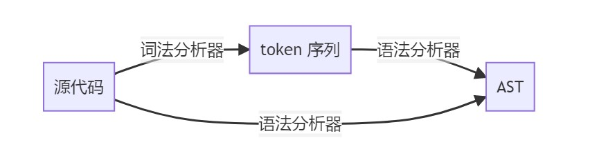
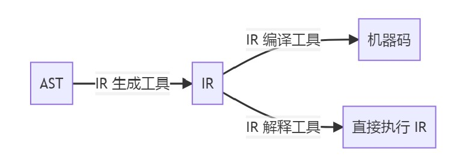
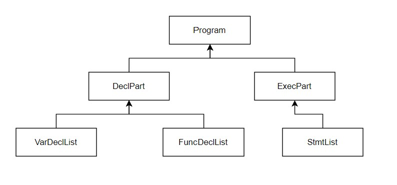

# 编译原理Project-实验报告

### **组员信息：**

​	**张振宇    3190104896**

​	**颜天明    3190105027**

​	**高婧        3180104228**


### 一、工程概述

​	我们实现的语言是类似Pascal语言格式的MiniPascal语言，可以说是Pascal语言的子集，在一些地方做出了改变。

​	我们支持的功能有：

- 基本数据类型：integer，char，bool，real
- 数组：支持所有基本数据类型
- 全局变量与局部变量的声明与使用
- 函数的声明与调用
- 基本语句：if-else, while, repeat, for, break等
- 注释
- 赋值语句和运算语句隐含类型转换
- 编译错误提示

​	我们开发的环境为：Ubuntu -18.04，flex，bison，LLVM-6.0，Clang-6.0

​	开发全程采用Github进行版本控制及协作，目前commit次数达50余次

​	

​	采用的技术路线为：利用lex进行词法分析生成Token序列，利用yacc进行语法分析并构建语法树。

​	即下图中的上面一条路线。



​	生成语法树之后，利用LLVM框架，遍历语法树生成IR代码。

​	生成IR代码之后，直接利用Clang编译器将IR代码编译为机器码，生成可执行文件




### 二、词法分析

### 三、语法分析

### 四、语法树结构设计

利用面向对象的思想，我们将AST的每个节点定义成类和对象。利用多态和继承，我们将语法树的每一个节点抽象为基类BaseNode，基类中存储着每个节点共有的属性：classname，line-number，并定义了通用的方法及生成中间代码所用的CodeGen函数。

```c++
class BaseNode{
private:
    int line_num=-1;
    string classname = "base";
public:
    BaseNode(string name){ this->classname = name; }
    string getClass() const { return this->classname; }
    virtual llvm::Value *CodeGen(CodeGenContext &context) = 0;
};
```

利用基类BaseNode，我们将其余类对其进行继承，大致分为以下几类：

- 划分程序区域类型
- 表达式类型
- 语句类型
- 类型、变量、函数等与定义相关的类型

**划分区域：**

划分区域的节点的主要作用是将各区域的语句综合起来，有序的连在区域节点之下。通过这种设计，我们可以将程序清晰的分为几个区域，及更加细分为子区域，最终到达叶子节点。

采用这种设计的好处是：

- 每种区域都有特定的类，指针也根据具体情况而特化，这样能使语法树的语义更加清楚。
- 利用多态的机制，为每个节点增加一个CodeGen的虚函数，这样通过定义每种类的CodeGen方法，我们并不需要完全知道孩子是什么类型的派生类，只需要调用他们的CodeGen方法即可。
- 这种设计在定义语法树时需要很多代码，但是在使用时带来了极大的方便，因为我们在向下时已经清楚的知道了这种节点的孩子个数，如何使用。

类定义示例如下图所示：

```c++
class DeclPart : public BaseNode
{
private:
    VarDeclList *varlist;
    FuncDeclList *funclist;

public:
    DeclPart():BaseNode("declpart"){}
    DeclPart(VarDeclList *v, FuncDeclList *f) : BaseNode("declpart"), varlist(v), funclist(f) {}
    VarDeclList *getVarListNode() { return this->varlist; }
    FuncDeclList *getFuncPartNode() { return this->funclist; }
    virtual llvm::Value *CodeGen(CodeGenContext &context);
};
```

区域的划分大致如下：



Program分为定义部分和执行部分，定义部分分为一组变量定义和一组函数定义。执行部分就是要执行的语句列表。


**表达式类型：**

表达式类型的节点都继承于基类Expr，共分为：

- IDExpr：存储立即数、变量名的表达式
- BinExpr：二元计算型的表达式
- UnaryExpr：一元计算型的表达式
- FuncallExpr：调用函数返回结果的表达式
- ArrayExpr：指定下标的数组的表达式


**语句类型：**

语句类型的节点都继承于基类Stmt，共分为：

- AssignStmt：赋值语句，左面是变量，右面是值
- ForStmt：循环类型的语句
- FunCallStmt：调用函数的语句（无用返回值）
- RepeatStmt：循环类型的语句
- WhileStmt：循环类型的语句
- IfStmt：条件控制类型的语句
- ElseStmt：和If配套使用
- BreakStmt：跳出循环的语句


**定义相关类型：**

定义相关的类型主要有：

MyType：类型的基类，派生类有：

- SimpleType：基本数据类型
- ArrayType：数组类型

OneFuncDecl：一个函数的定义

- FuncHead：函数头，包含函数名，返回类型，参数表
- FuncBody：变量定义、语句列表

VarDecl：一组变量定义

- 存有MyType类型的type
- IDList，变量名表

​	

### 五、语法树可视化

### 六、中间代码生成

##### 1、基本框架与语法树遍历方法：

在中间代码的生成中，我们主要使用的框架是LLVM框架，使用的版本是6.0 （ubuntu apt安装）

如上文所述，每个节点都有属于自己的虚函数方法。这样的话就可以采用一种“自驱动”的遍历方式。父节点调用子节点的Codegen方法，子节点的CodeGen方法也会进一步调用子节点的方法，如此以来就很自然的实现了语法树遍历，不用特别考虑遍历的顺序就可以实现正确顺序的遍历。

例如在赋值语句的CodenGen方法中：

```c++
llvm::Value* AssignStmt::CodeGen(CodeGenContext &context){
    cout<<"Generate AssignStmt..."<<endl;

    context.genpointer=true;
    auto lhs = this->getLeftExprNode()->CodeGen(context);
    
    context.genpointer=false;
    auto rhs = this->getRightExprNode()->CodeGen(context);
    
    ......
    
    return rhs;
}
```

这个节点可以直接调用

### 七、编译器测试

### 八、心得与体会